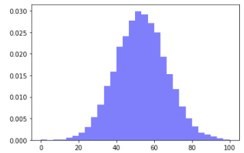
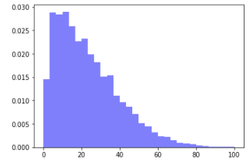

# Mini-Lesson 1.5: What Are Histograms and Why Do They Matter?

In addition to discussing column operations in Video 1.6: pandas Operations and Plot, Dr. Gomes also talked about plotting in pandas. As a supplement, you can read about a few of the advantages of visualizing your data with histograms in this mini-lesson.

## Histograms

Histograms are commonly used to visualize the distribution of a single numerical variable. The histogram divides a numeric variable into multiple bins, and these bins calculate the observations that fall into each bin. This columnar representation of binned counts gives you an instant sense of the distribution of values in a variable. Pandas provides a function for this called `hist()` that generates a histogram per column of numerical data. In data science, histograms are important during exploratory data analysis because they reveal properties about data in ways that summary statistics cannot. Histograms reveal the shape of the data, skewed data, and outliers that might be present.

## Data Shapes

Histograms can assist in determining the symmetry of your dataset. Normally distributed data, which typically has the infamous bell-shaped curve (as in Figure 1), lets you know that your dataset is more analytically appealing.

*Figure 1: Normal Distribution*

## Skewed Data

The identification of skewed data using a histogram is an important factor in determining the suitability of the dataset. Typically, a histogram with skewed data differs from a normal distribution in that one tail seems to drag on longer than the other side. This skew can be to the left (as in Figure 2) or the right. This may require you to perform some data transformation to fit a more normal distribution.

*Figure 2: Skewed Distribution*

## Outliers

Outliers (as in Figure 3) are an important tool when visualizing histograms. Outliers can be explained or unexplained observations, and they may require some type of investigation to understand their legitimacy. Once the investigation of this anomaly has been completed, you can perform some data transformation to fit a more normal distribution.

*Figure 3: Distribution with Outliers*

