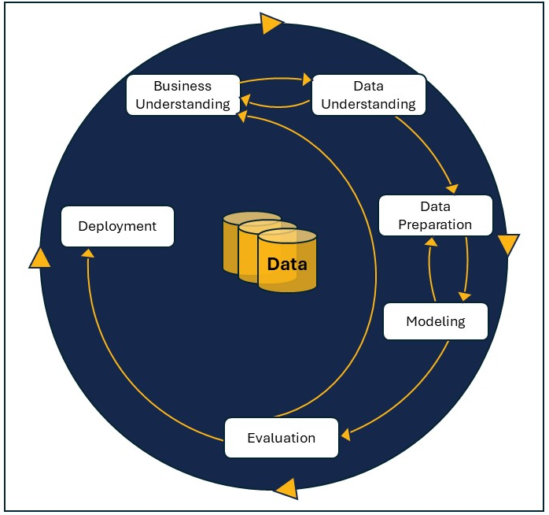

# Required Discussion 3.1: Applications of the Data Science Lifecycle

## Learning Outcome Addressed
Discuss real-world contexts for the data science lifecycle.
This is a required discussion and counts toward program completion.

So far in this module, you have learned about the CRISP-DM framework, which includes the required business understanding, data knowledge and preparation, modeling, evaluation, and deployment, as shown below.

Drawing from your day-to-day experience or research, please provide a use case for implementing this framework. The CRISP-DM framework can be applied to projects in multiple industries. Discuss some of the strengths and weaknesses of applying it to the use case you provided. Additionally, please discuss any frameworks (e.g., TDSP or OSEMN) that you have applied that may be useful to this discussion.

# CRISP-DM Implementation at Harmonate: A Case Study

## Introduction
I work at Harmonate as a development consultant, implementing an intelligent document processing system using the CRISP-DM framework. It is a continuous process, and we have already begun to notice major improvements in how we handle financial data.

The team at Harmonate felt that their current document processing system needed to be improved for the organization's growth and development. As our customer's financial statements began to mount, analysts were swamped with manual data entry, and it became apparent that a better alternative was needed.

## CRISP-DM Framework Implementation
Working according to the CRISP-DM framework is proving invaluable to this project. Here's how:

### Business Understanding Phase
The Business Understanding phase has kept fine-tuning our objectives and setting challenging goals regarding accuracy improvement, reduction of processing times, and cost savings. This phase helped maintain a clear focus on delivering tangible business value and ensured every step taken was oriented toward Harmonate's strategic needs.

### Data Preparation Phase
Currently, we are working on the most labor-intensive phase of the project: data preparation. This phase involves standardizing formats, cleaning poor-quality files, and intricately annotating documents to make a robust training dataset. It is quite tedious but very important since it provides the foundation for our model's success.

### Modeling Phase
As we move to the Modeling phase, we are collaborating with third-party vendors on designing appropriate training methods for the corpus data that will be collected over the company's five years of existence.

### Evaluation Phase
The Evaluation phase of the model is ongoing and iterative. Each iteration is rigorously tested against our success criteria, and we involve senior financial analysts in reviewing the output. This serves to continually refine our approach and improve the system's accuracy.

## Benefits and Challenges

### Key Benefits
Operating under the CRISP-DM framework is enhancing our process in several ways:

- It is a structured approach that keeps us organized while not omitting any critical steps.
- Business understanding has emphasized our work to date and kept us in step with Harmonate's goals for this project.
- The focus on data understanding and preparation has proved to be crucial for creating a robust and correct system.

### Challenges
There are also drawbacks to the approach. The whole process is time-consuming as it involves so much rigor, sometimes contradicted by the fast-moving pace of finance. We have also found that we must augment this framework with other strategies if we are concerned with certain issues in the financial sector, like data privacy and regulatory compliance.

## Conclusion
Despite these setbacks, the CRISP-DM framework thus far has given us a solid basis to ground our project for intelligent document processing. Going ahead with these upgrades above in terms of speed and accuracy at work in our test runs, though far from actual deployment, indeed we have substantial work ahead of us, especially during the modeling and eventual deployment phases-the structured approach of CRISP-DM most definitely is leading us through this very complex project.