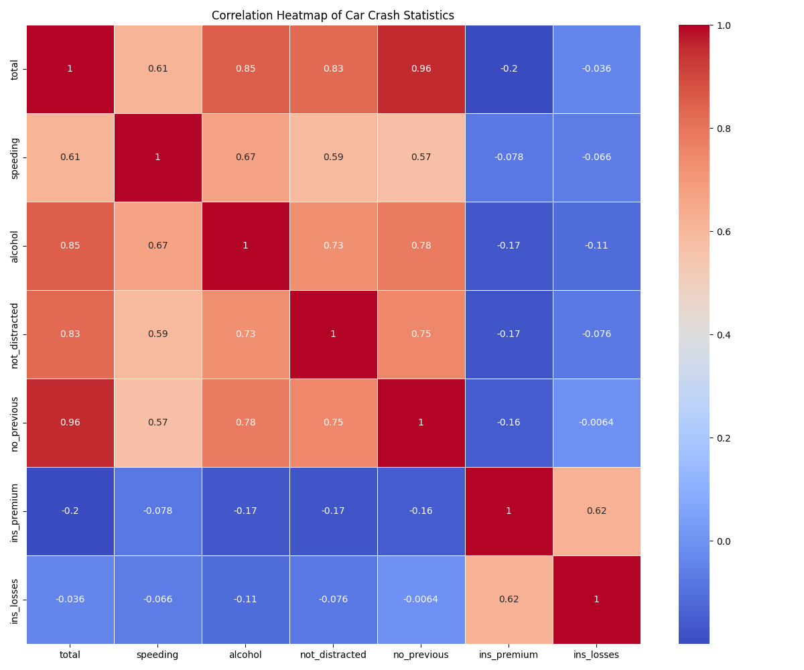

# Self-Study Try-it Activity 3.1: Creating Data Visualizations

Building on the previous Codio activity, please select a dataset that is of interest to you. This could be a dataset provided in this program or one that you have sourced from the Internet. Utilizing the selected dataset, please create a visualization that best describes the data.

## Assignment Requirements

Post the following to the discussion board:

1. Attach your visualization
2. Explain the method you used to create the visualization
3. Share what library you used
4. Describe the results you found and what they tell you about the dataset you chose

## Note on Visualization Requirements

Your visualization does not have to be something that you spend hours on making it look 'just right,' as the rubric is purposefully vague when it comes to style, layout, etc. However, you may find the following resources helpful in guiding your creation of your visualization:

* [8 Ways to Turn Good Data into Great Visualizations](https://www.gooddata.com/blog/8-ways-turn-good-data-great-visualizations/) (January 22, 2020): GoodData presents eight principles of good data visualization.
* [Visualizations That Really Work](https://hbr.org/2016/06/visualizations-that-really-work) (June 2016): Harvard Business Review presents a framework for creating visualizations.
* [Why Is This Chart Bad? The Ultimate Guide to Data Visualization Evaluation Using GoDVE](https://towardsdatascience.com/why-is-this-chart-bad-5f16da298afa) (July 28, 2020): This resource both analyzes several visualizations, points out the flaws with each visualization, and presents a framework for developing visualizations.

## Dataset Selection

Please note: Select an appropriately sized dataset for this program and your skill level (e.g., beginners might use a dataset with five or fewer columns and about one hundred rows).

### Dataset Resources

You can find datasets at:
* [Kaggle.com/datasets](https://www.kaggle.com/datasets)
* [Amazon Web Services (AWS) Marketplace](https://aws.amazon.com/marketplace/search/results?category=d5a43d97-558f-4be7-8543-cce265fe6d9d&FULFILLMENT_OPTION_TYPE=DATA_EXCHANGE&filters=FULFILLMENT_OPTION_TYPE)
* [Datashop](https://pslcdatashop.web.cmu.edu/)

## Example Solution



### Code Used
```python
import seaborn as sns
import matplotlib.pyplot as plt

car_crashes = sns.load_dataset('car_crashes')
numeric_columns = car_crashes.select_dtypes(include=['float64', 'int64'])

plt.figure(figsize=(12, 10))
sns.heatmap(numeric_columns.corr(), annot=True, cmap='coolwarm', linewidths=0.5)
plt.title('Correlation Heatmap of Car Crash Statistics')
plt.tight_layout()
plt.savefig('images/crash.png')
```

### Analysis
I created a correlation heatmap using Seaborn's `heatmap()` function. This visualization shows the correlation between different variables in the car_crashes dataset. Each cell in the heatmap represents the correlation coefficient between two variables, with colors indicating the strength and direction of the correlation.

The heatmap reveals several interesting patterns in the car_crashes dataset:
* 'speeding' and 'alcohol' show a moderately strong positive correlation, suggesting these factors often occur together in car crashes
* 'no_previous' (presumably meaning no previous accidents) has negative correlations with most other variables, indicating that drivers with no previous accidents are less likely to be involved in crashes overall
* 'ins_premium' (insurance premium) and 'ins_losses' (insurance losses) show strong positive correlations with most crash types, suggesting that areas with higher crash rates also have higher insurance costs