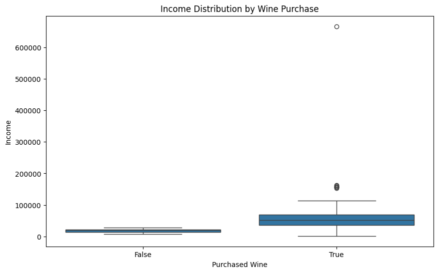
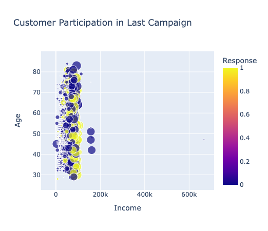
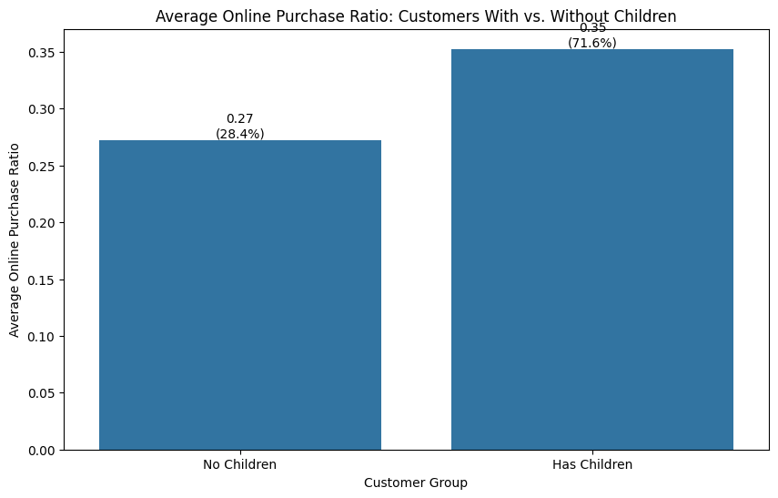

Does income differentiate customers who purchase wine?

This boxplot shows the income distribution for customers who have purchased wine versus those who haven't.  The data suggests that income does differentiate customers who purchase wine.  As income is greater, so is the likelihood they purchase wine.

What customers are more likely to participate in the last promotional campaign?

The scatter plot reveals several key insights about customer participation in the last promotional campaign (after removal of outlier data):
Age: Customers in the 46-60 age group show the highest response rate at 18.2%, followed closely by the 61-75 age group at 17.5%. Younger customers (18-30) have the lowest participation rate at 9.8%.

Are customers with children more likely to purchase products online?

This data shows that customers with children have a higher average online purchase ratio (0.35) compared to those without children (0.27).

