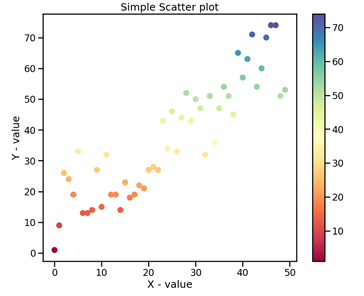
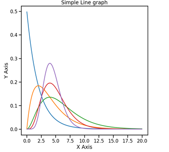
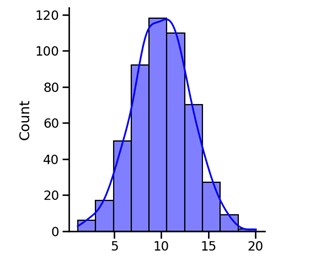
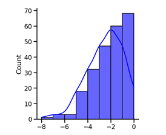
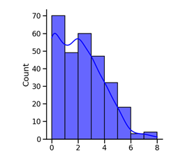
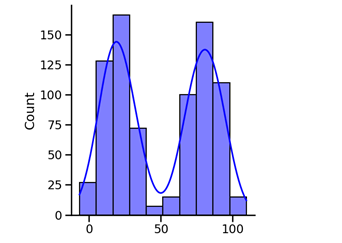

# Mini-Lesson 4.1: Histograms and Distribution Plots

In data science, a distribution plot is a simple visual representation of the distribution of numerical values. These plots show the distributions of data variables that are typically separated into equal ranges called bins. The height of the distribution plot represents the numerical value of the bin (also known as its frequency). In this mini-lesson, you will learn about different types of distribution plots and some use cases for each.

## Scatterplot

A scatterplot is a graph in which two variables are plotted along the x- and y-axes. With this primary plot type, you can visualize the distribution between two variables, both of which can either increase or decrease. When the two variables move in the same direction, they have a positive linear relationship. When they move in opposite directions, they have a negative linear relationship.

As an example, in Figure 1 below, the x-value increases as the y-value increases, which indicates a positive linear relationship.

*Figure 1: A scatterplot where the values along the x-axis and y-axis increase linearly*

## Line Chart

A line chart uses points connected by line segments from left to right to demonstrate data distribution. This type of chart is often used to plot multiple lines within the same chart that can then be used to compare trends between subgroups. In addition, line charts can be helpful in analyzing how the data is broken down into different subgroups.

*Figure 2: An example of a simple line chart showing five different plotted lines*

## Normal Distribution

As discussed in Module 2, normal distribution is a common pattern, in which points are equally likely to occur on both sides of the average (as shown in Figure 3). The term normal refers to the typical distribution for a given process.

*Figure 3: A plot showing a normal distribution*

## Skewed Distribution

A skewed distribution can be considered asymmetric since a natural limit prevents outcomes from one side. Thus, the distribution peak lies off-center at the limits, and the tail extends away from it. Based on the direction of the tail, these distributions are called left-skewed (Figure 4) or right-skewed (Figure 5).

*Figure 4: A plot showing a left-skewed distribution*

*Figure 5: A plot showing a right-skewed distribution*

## Double-Peaked or Bimodal Distribution

A bimodal distribution, as shown in Figure 6, resembles the back of a two-humped camel. In this type of plot, the dataset comprises the results of two processes with different distributions. You can place these distributions side by side to make comparisons.

*Figure 6: A plot showing a double-peaked or bimodal distribution*

## Conclusion

There are a number of instances where a data scientist might use a distribution plot, such as:

- To represent numerical data or the count of categorical data
- To examine the shape of data distribution, especially when assessing whether the output of a process follows an approximately normal distribution
- To determine whether a process meets the requirements of the customer
- To assess the quality of a supplier's output
- To examine whether a process has changed from one period to the next
- To analyze whether two or more processes produce different outputs
- To communicate the implications of data distribution quickly and efficiently