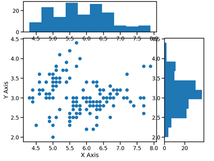
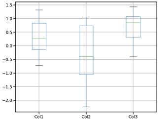
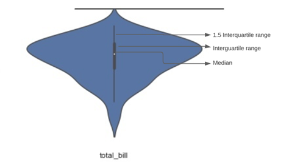
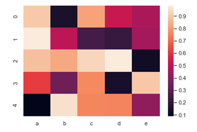

# Mini-Lesson 4.2: Other Types of Plots

In data science, various plots are used to communicate results or understand data. These plots come in a variety of shapes, sizes, and colors. Although this mini-lesson does not offer an exhaustive list, it covers some of the plots you may encounter during your data journey.

## Joint Plot

In the previous mini-lesson, you learned about distribution plots. A joint plot is similar to a distribution plot, as it combines a scatterplot and two histograms, ultimately containing three plots (as shown in Figure 1). The first plot is a scatterplot that shows the relationship between the dependent variable (y-axis) and the independent variable (x-axis). The second plot is affixed horizontally at the top of the scatterplot and shows the distribution of the independent variable. Finally, the orientation is vertical in the third plot, showing the dependent variable's distribution (y-axis). This plot is positioned on the right margin of the scatterplot.

*Figure 1: An example of a joint plot, including a scatterplot and two histograms on to the top and right of the scatterplot*

### When would a data scientist use a joint plot?

A joint plot is used to visualize and describe the relationship between two variables in a single plot.

## Box Plot

A box plot (also referred to as box and whisker plot) provides a graphical representation of nonparametric descriptive statistics. For example, in Figure 2, the box represents the distance between the first and third quartiles. The median between them is marked with a green line. The horizontal gray lines to the top and bottom of the blue box represent the maximum and minimum values, respectively.

*Figure 2: An example of a box plot with three columns*

### When would a data scientist use a box plot?

A box plot is useful when displaying descriptive statistics. When presented to an audience, this graphical representation of data is often more effective than quoting a list of descriptive statistics. Visualizing the central location and spread of values as a picture can be much easier to interpret than a list of numbers.

## Violin Plot

In general, violin plots are a method of plotting numeric data and can be considered a combination of a box plot with a kernel density plot. The vertical gray line shows the median of the data distribution, while the shape on each side represents the kernel density estimation. The wider sections of the violin plot (shown in blue in Figure 3) represent a higher probability of all population members taking on a given value; the thinner sections indicate a lower probability.

*Figure 3: Violin plot showing median, interquartile range, and probability of all population members taking on a given value*

### When would a data scientist use a violin plot?

By using violin plots, you can observe the range, median, and distribution of the data at once.

## Heat Map

A heat map is a graphical representation of data in which the values of a matrix are depicted as colors. The different colors provide visual cues about the magnitude of certain numeric values. One example of how heat maps are commonly used is to determine how air pollution varies depending on the time of day across a set of cities.

*Figure 4: An example of a heat map that uses different hues to communicate differences in numeric values*

### When would a data scientist use a heat map?

A heat map is useful for visualizing the number of locations and events in a dataset. This plot type also makes it easy to direct viewers to specific areas of the data visualization that require attention.