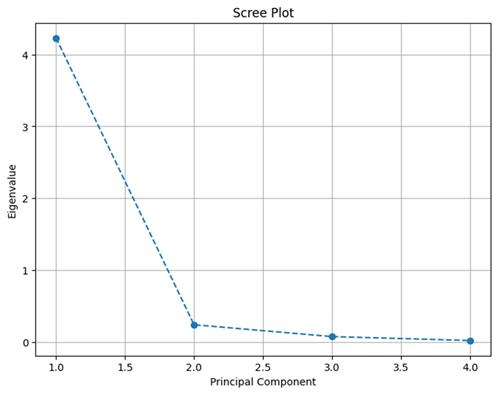

# Mini-Lesson 6.2: Scree Plot

## Introduction
A scree plot is a graphical representation used in PCA and factor analysis to help determine the number of principal components or factors to retain in a model. It displays the eigenvalues associated with each principal component or factor in descending order. In PCA, identifying the principal components is crucial because they play a key role in understanding the structure of the data, reducing dimensionality, and improving the efficiency of subsequent analyses.

The scree plot is used to identify the number of significant components. The components to the left of the 'elbow' (where the curve starts to level off) are considered significant, while those to the right are considered less important and likely to contribute less to explaining the variance in the data. Please see an example of a scree plot below:

## Key Features of a Scree Plot

### Axes
- The x-axis represents the principal components or factors (typically labeled as PC1, PC2, PC3, etc.)
- The y-axis represents the eigenvalues (or sometimes the explained variance) corresponding to each principal component or factor

### Curve
The plot shows a curve that typically starts at a high value (the first eigenvalue) and decreases as the eigenvalues diminish. The point at which the curve starts to flatten is called the 'elbow.'

## Interpretation of a Scree Plot

### Look for the elbow
The elbow point is where the plot begins to level off. This point indicates the transition from significant to less significant components.

### Retain components before the elbow
Generally, components before the elbow are retained as they contribute the most to explaining the variance in the data.

### Ignore components after the elbow
Components after the elbow contribute minimally to explaining the variance and can often be disregarded.

## Example Analysis: Iris Dataset

Let's return to the following scree plot image for the standard iris dataset:

*Source: https://www.researchgate.net/figure/The-scree-plot-of-the-robust-PCA-method_fig3_354265261*

The plot above is a graph depicting the principal components and the eigen values.

### Analysis:
1. **Elbow point**: The plot shows a sharp drop after the first principal component (PC1) and a more gradual decline after the second component (PC2).

2. **Retaining components**: The elbow appears around PC2, suggesting that retaining the first two principal components might be sufficient to capture most of the variance in the data.

3. **Dimensionality reduction**: By retaining only PC1 and PC2, the dataset's dimensionality can be reduced from four to two dimensions, simplifying the model while preserving most of the important information.

## Relationship between SVD, PCA, and Scree Plot

This approach helps in simplifying models and reducing computational complexity, which is especially useful in data analysis and ML tasks. The relationship between SVD, PCA, and the scree plot is interconnected through the common goal of dimensionality reduction and data analysis:

1. **SVD** provides the underlying mathematical framework for PCA by decomposing the data matrix into singular values and singular vectors.
2. **PCA** uses the results of SVD to identify the principal components, which capture the most significant variance in the data.
3. **Scree plot** is a tool used in PCA to visually determine the number of principal components to retain by plotting the eigenvalues and identifying the point where they start to level off.

Together, these techniques help in effectively reducing the dimensionality of data while preserving its essential structure and variance.

## Real-World Example
A company wants to analyze customer data and the dataset being used includes hundreds of features such as age, income, purchasing history etc. The larger the set of features, the more complex the model becomes. By applying PCA, the company can reduce the number of features to a smaller set of principal components that capture the majority of the variance in the data. The scree plot then helps the company identify how many principal components should be retained.