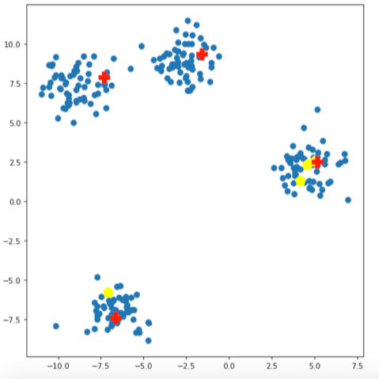

# Mini-Lesson 6.4: Comparing k-means++ and Random Initialization

## Overview
k-means is one of the most popular unsupervised 'clustering' algorithms used today. It stores 𝑘 centroids, used to define clusters of data points. A point is considered in a particular cluster if it is closer to that cluster's centroid than any other centroid.

## Initialization Methods

### Random Initialization (Traditional)
The random implementation of k-means uses random 𝑘 data points selected from the dataset as the initial centroids. However, with this approach, the selected centroids may not be well positioned throughout the entire data space, as it is highly volatile, which results in poor data clustering.

### k-means++ Initialization
k-means++ can overcome this condition in two ways:

1. By incorporating a method to calculate an optimal value for the initial centroid, finding the next optimal centroid based on the placement of the first centroid
2. By continuing this process until all centroids have been found. Additionally, k-means++ runs the entire algorithm multiple times, ending up with the centroids that provide the lowest inertia.

## Visual Comparison
The plot below provides an example:
- Yellow dots: randomly selected centroids
- Red plus signs: centroids selected with k-means++

Notice random selection (yellow dots) placed three randomly initialized centroids in the rightmost cluster, one of which is directly under the red plus sign from the k-means++ placement, with the fourth random centroid being in the lower left cluster.

In contrast to random centroid placement, k-means++ has placed an initialized centroid in each of the clusters. This will result in a much smaller inertia to the data.

