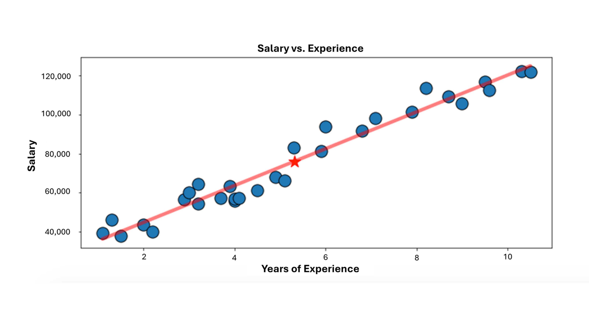
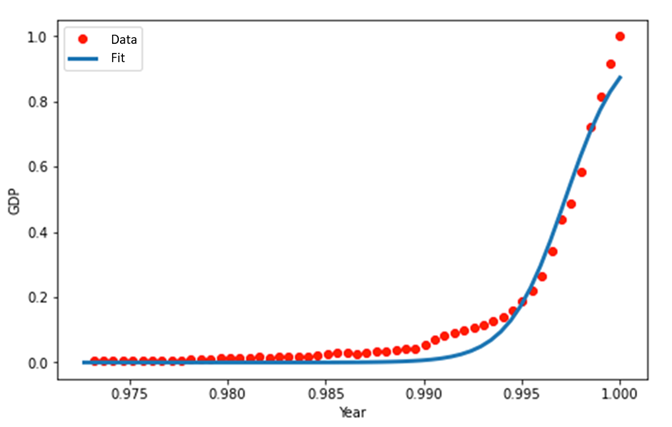

# Mini-Lesson 7.1: What Is Regression?

## Introduction to Supervised Learning
Supervised learning is a type of machine learning in which the model is trained on a labeled dataset, meaning each training example is paired with an output label. The goal is for the model to learn the mapping from inputs to outputs and make predictions for new, unseen data. There are various types of supervised learning algorithms, which can be broadly categorized into regression and classification algorithms. The goal of regression algorithms is to predict a continuous numerical value. Examples include predicting house prices, stock prices, or temperatures. In contrast, the goal of classification algorithms is to predict a discrete label or category. Examples include classifying emails as spam or not spam, identifying the species of an iris flower, or determining if a patient has a certain disease. The output of a regression algorithm is a continuous value, while the output of a classification algorithm is a categorical value.

## Understanding Regression
Regression, at its core, is simply comparing one variable with another variable and finding the relationship between the two. Regression also determines how strongly one variable influences another. Linear regression assumes that the relationship between variables can be plotted using a straight line (hence the term 'linear').

Linear regression strives to model a relationship between two variables by fitting the observed data to a linear equation. Of the two variables, one variable is evaluated as an explanatory (or independent) variable, while the other is considered a dependent variable. The linear regression equation can be expressed as:

$Y_i = B_0 + B_iX_i$

where:
- $X_i$ is the explanatory variable
- $Y_i$ is the dependent variable
- $B_i$ is the slope of the line
- $B_0$ is the intercept

### Example: Experience vs. Salary
In Figure 1, you can observe the relationship between two variables: experience and salary.

X stores the years of experience as the explanatory variable, and Y stores the salary as the dependent variable. As years of experience rise, so does salary. Thus, these variables are positively correlated, and the data 'fits' around the sloped red line.

### Nonlinear Regression
What if the data does not fit a neat, clear line like salary and experience? For this, there is nonlinear regression. The following example examines the relationship between gross domestic product (GDP) and year. X stores the GDP as the dependent variable, and Y stores the year as the independent variable. In this example, nonlinear regression is used in places where the data is not perfectly linear and, instead, shows a curvy trend. If you were to use linear regression for this problem, your model would produce inaccurate results.

While linear regression can be implemented to solve many machine learning problems, it cannot fit data that is nonlinear. In this instance, you can use nonlinear regression to model data that is not linear. This module focuses on linear regression models and techniques. You will explore nonlinear regression in a future module.