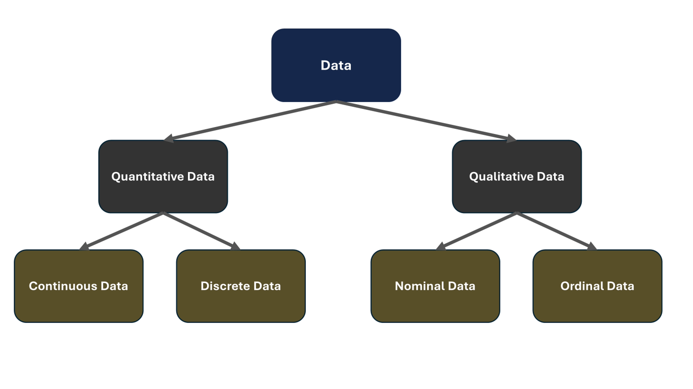
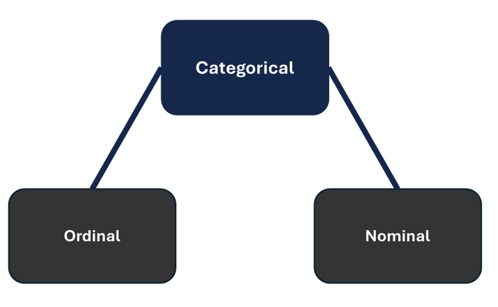

# Mini-Lesson 7.3: Ordinal, Nominal, and Categorical Data Types

Data scientists need to understand the concept of data types to correctly apply statistical measurements to their data and therefore make accurate conclusions about it. The purpose of this mini-lesson is to introduce you to the different types of data you need to know to perform exploratory data analysis, an often-overlooked part of machine learning projects.

Data is primarily classified as quantitative data and qualitative data. Quantitative data can be discrete or continuous. Qualitative data, also called categorical data, can be nominal or ordinal.

## Quantitative Data Types

Continuous: Represents measurements that can take on an infinite number of values within a range—examples include height, weight, temperature, and time

Discrete: Represents countable values that are distinct and separate—examples include integers and whole numbers, such as counts of items, number of people, or number of events

This lesson focuses on categorical data types. The categorical data type has two subcategories: Nominal and ordinal.

Nominal data (sometimes called 'labeled' or 'named' data) type is used to name variables with no numerical value and that have no inherent order or ranking. For example, gender (male or female) has no specific order. This type of data is typically collected via surveys or questionnaires.

Conversely, ordinal data has a clear ordering or scale to it. For example, things such as bug scales, customer satisfaction survey data, or interval scales have different collection and analysis techniques but are all considered ordinal data.