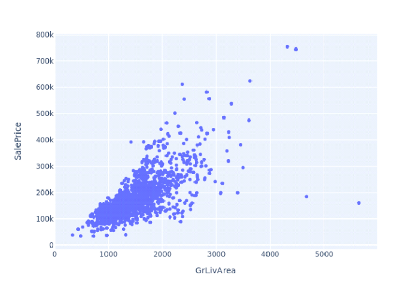
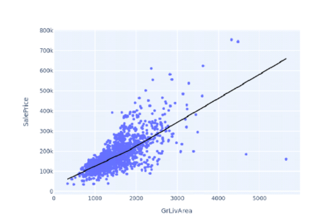

# Module 7 Quiz: Linear Models and Correlation

## Question 1 (1 point)
What type of problems can be solved using linear models?

**Options:**
1. Problems with categorical outcomes
2. Problems with nonlinear relationships
3. Problems with exponential growth patterns
4. Problems with continuous numerical outcomes

**Answer:** Option 4: Problems with continuous numerical outcomes

*Explanation:* Linear models are specifically designed to model relationships between variables where the outcome (dependent variable) is continuous and numerical. This is a fundamental characteristic of linear regression. The model assumes a linear relationship between inputs and outputs, making it suitable for predicting continuous values but not categorical outcomes or inherently nonlinear patterns.

---

## Question 2 (1 point)
What kind of correlation is there between the two variables shown in the scatterplot?

**Options:**
1. Negative correlation
2. Positive correlation
3. No correlation
4. Nonlinear correlation

**Answer:** Option 2: Positive correlation

*Explanation:* The scatter plot clearly shows a positive correlation between GrLivArea and SalePrice - as one variable increases, the other tends to increase as well. The points follow an upward trend from bottom-left to top-right, which is the classic pattern of positive correlation.

---

## Question 3 (1 point)
The trend line in the given scatterplot is an example of which model?

**Options:**
1. Exponential growth model
2. Nonlinear model
3. LOWESS model
4. Linear model

**Answer:** Option 3: LOWESS model

*Explanation:* The trend line shown in the scatter plot is a LOWESS (Locally Weighted Scatterplot Smoothing) model. Unlike a simple linear model which would show a straight line, LOWESS creates a smooth curve that follows the local patterns in the data. This makes it more flexible in capturing the underlying relationship between variables, especially when the relationship isn't perfectly linear.

---

# Answer Key
1. Option 4 - Problems with continuous numerical outcomes (Linear models predict continuous values)
2. Option 2 - Positive correlation (Clear upward trend in scatter plot)
3. Option 3 - LOWESS model (Uses local weighted regression to create a smooth curve that follows data patterns)