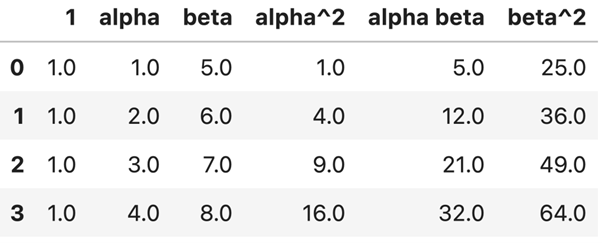

## Mini-Lesson 8.2: Scikit-Learn Data Preprocessing

A polynomial feature is a feature that is created by raising an existing feature to a power or by multiplying two or more existing features together. For example, if you have a feature 𝑥, the polynomial feature of degree 2 is 𝑥². Similarly, if you have two features 𝑥 and 𝑦, the polynomial features of degree 2 are 𝑥², 𝑦², and 𝑥𝑦.

Polynomial features allow us to improve our model by capturing nonlinearity including feature interactions:

### Nonlinearity in single variable
Consider the example from Video 8.4 that showed the fuel efficiency vs. the horsepower of an engine. Adding the square of the horsepower as a feature allowed for a better fit.

### Nonlinearity via feature interactions
Polynomial features also enable the model to capture interactions between features. For example, if there are two features 𝑥₁ and 𝑥₂, adding the polynomial features of degree 3 would yield the features 𝑥₁³, 𝑥₁²𝑥₂, 𝑥₁𝑥₂², and 𝑥₂³. This can be important if the output of the model is modeled well by the products of powers of 𝑥₁ and 𝑥₂.

## The Polynomial Features Transformer
In scikit-learn, transformers are classes that are used to transform data. The PolynomialFeatures class is a transformer that is specifically designed to generate polynomial features from the input data rather than having to manually create the polynomial features.

### Fit and Transform
Here's an example showing how this works:

```python
import pandas as pd
from sklearn.preprocessing import PolynomialFeatures

df = pd.DataFrame({
    "alpha": [1, 2, 3, 4],
    "beta": [5, 6, 7, 8]
})

# Create a PolynomialFeatures transformer which can generate features of up to degree 2

poly_transform = PolynomialFeatures(degree=2)

# Determine the number and name of the features of up to degree 2
# For this example, there will be a bias term, alpha, beta, alpha^2
# alpha*beta, and beta^2, for a total of six features

poly_transform.fit(df[["alpha", "beta"]])

# For each row of df, generate the values of our six output features

transformed_data = poly_transform.transform(df[["alpha", "beta"]])
```

The functions called are:

**Fit**: When you create a PolynomialFeatures object and call its fit method with your data, the transformer analyzes the data to determine the number and names of the output features. The actual values of the output features are not calculated yet. The number of output features depends on the degree of the polynomial and the number of input features.

**Transform**: Once the transformer is fitted, you can call its transform method with new data to generate polynomial features based on the degree you specified. For each sample in the input data, the transformer creates all possible polynomial combinations of the features up to the specified degree. The output of this method is an array containing the polynomial combinations of the input features starting from degree 0 up to the specified degree.

For example, the input dataframe provided as input to the fit and transform methods in the example above is:

*The input dataframe for the fit and transform methods as depicted in the example*

Since we've asked for the degree 2 features (bias term, alpha, beta, alpha², alpha × beta, beta²) the output of the transform method is the array. For example, on the second row, the 12 is alpha × beta = 2 × 6 = 12.

*An array that depicts the output of the transform method*

### get_feature_names_out
The output of the transform method is a NumPy array. If we want to know the names of the features, we can call get_feature_names_out. For example, if we call `poly_transform.get_feature_names_out()` in the example above, we'd get back the array `['1', 'alpha', 'beta', 'alpha^2', 'alpha beta', 'beta^2']`.

The example below shows how we can use this function to generate transformed_data in DataFrame format with named columns rather than as unnamed NumPy array columns.

```python
import pandas as pd
from sklearn.preprocessing import PolynomialFeatures

df = pd.DataFrame({
    "alpha": [1, 2, 3, 4],
    "beta": [5, 6, 7, 8]
})

# Create a PolynomialFeatures transformer which can generate features of up to degree 2

poly_transform = PolynomialFeatures(degree=2)

# Determine the number and name of the features of up to degree 2
# For this example, there will be a bias term, alpha, beta, alpha^2
# alpha*beta, and beta^2, for a total of six features

poly_transform.fit(df[["alpha", "beta"]])

# For each row of df, generate the values of our six output features

transformed_data = pd.DataFrame(poly_transform.transform(df[["alpha", "beta"]]), columns=poly_transform.get_feature_names_out())
```

The resulting transformed_data is:



### fit_transform
Scikit-Learn provides a shortcut fit_transform method that fits and transforms at the same time. For example:

```python
import pandas as pd
from sklearn.preprocessing import PolynomialFeatures

# Hard code the DataFrame with 4 rows and integer alpha and beta values

df = pd.DataFrame({
    "alpha": [1, 2, 3, 4],
    "beta": [5, 6, 7, 8]
})

poly_transform = PolynomialFeatures(degree=2)
transformed_data = poly_transform.fit_transform(df[["alpha", "beta"]])
```

## Pipelines in Data Preprocessing
Pipelines in data preprocessing are used to chain together multiple transformers and estimators into a single workflow. This allows you to automatically apply one or more preprocessing steps to your data when calling fit or predict on an estimator. Pipelines are especially useful for keeping your code organized and for ensuring that the same preprocessing steps are applied consistently to any data provided to the model.

### Fitting a regression model
For example, suppose we fit a regression model on the data from the example above, as shown below:

```python
df = pd.DataFrame({
    "alpha": [1, 2, 3, 4],
    "beta": [5, 6, 7, 8],
    "y": [7.9, 16.1, 29.9, 42.1]
})

poly_transform = PolynomialFeatures(degree=2)
transformed_data = poly_transform.fit_transform(df[["alpha", "beta"]])

model = LinearRegression()
model.fit(transformed_data, df["y"])
```

If we wanted to know what this model would predict for alpha = 3, beta = 5, we can't just do:

```python
model.predict([[3, 5]])
```

This is because the model expects six features, not two.

Pipelines allow us to effectively glue together the polynomial transform and the model. An example is given below:

```python
from sklearn.pipeline import Pipeline

pipelined_model = Pipeline([
    ('josh_transform', PolynomialFeatures(degree = 3)),
    ('josh_regression', LinearRegression())
])

pipelined_model.fit(df[["alpha", "beta"]], df["y"])
```

In this example, the fit method first fits the PolynomialFeatures transformer, then fits the LinearRegression model. Note that it is required that each stage has a name, so I've named them after myself.

This pipelined model expects only two features: alpha and beta. That means that if we call the line of code below:

```python
pipelined_model.predict([[3, 5]])
```

The model knows how to handle this value and gives us back a prediction. First, it feeds [3, 5] to the josh_transform stage, then it feeds the resulting six features to the josh_regression model.

If for some reason you need to access specific pieces of the pipelined model, you can use named_steps. For example, the code below gets the coefficients of the linear model.

```python
pipelined_model.named_steps['josh_regression'].coef_
```

Pipelines can also string together multiple transformations in a row.