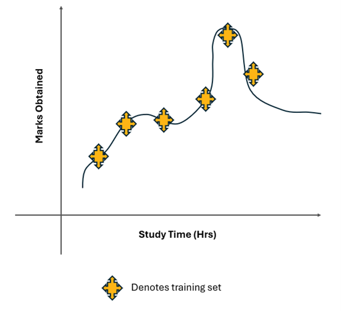
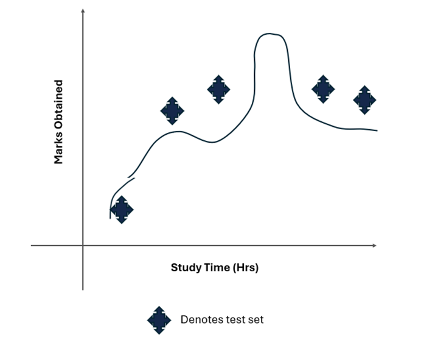

# Mini-Lesson 8.3: Overfitting, Underfitting, Bias, Variance

## Model Performance and Error Types

A machine learning model's performance is evaluated based on how accurate its prediction is and how well it generalizes to another independent dataset it has not seen. In machine learning, error refers to the difference between the predicted values generated by a model and the actual values from the data. Error is a critical measure because it indicates how well the model is performing. Lower errors indicate better model performance.

The errors in a machine learning model can be broken down into two parts: irreducible error and reducible error.

## Irreducible Error

Irreducible error refers to the inherent uncertainty or noise in any predictive modeling problem that cannot be reduced or eliminated by any model (no matter how sophisticated or well-tuned it is). This type of error is a fundamental limitation of the data and the real-world process being modeled.

### Sources of Irreducible Errors

- **Noise in Data Collection**: Data can contain random noise due to inaccuracies in measurement, data entry errors, or other unpredictable factors.
- **Unobserved Variables**: There may be influential factors that affect the outcome but are not included in the model because they were not measured or are unknown.
- **Stochastic Processes**: The underlying process generating the data might have an inherent randomness that cannot be captured by the model. For example, human behavior can be inherently unpredictable.
- **Approximation Errors**: Even the best models are only approximations of real-world phenomena, which are often too complex to be captured perfectly by any model.

Understanding irreducible error helps set realistic expectations for model performance. No matter how well a model is designed and trained, it cannot reduce this type of error.

## Reducible Errors

Reducible errors are the types of errors in a machine learning model that can be reduced or minimized through various techniques, such as better modeling, improved data quality, or more sophisticated algorithms. These errors arise from the limitations and imperfections of the model and the training process.

There are two types of reducible errors: bias errors and variance errors.

### Bias

Bias refers to the inability of a machine learning model to capture the true relationship between the data variables. It is caused by the erroneous assumptions that are inherent to the learning algorithm. Consider a scenario in which you want to predict students' marks based on the number of hours they study.

A simple linear regression model is used to make this prediction. The model assumes a straight-line relationship between study time and marks.

Model Assumption: `Marks = 𝑎⋅Study Time + 𝑏`

The relationship between study time and marks might be more complex. For example, the relationship might be quadratic or logarithmic because after a certain number of study hours, additional hours may contribute less to marks, or too much study could lead to fatigue and lower performance. If a linear regression model is used to fit a straight line through the data points, it assumes a linear relationship, and it cannot capture the actual curving pattern of the data. This gives rise to systematic errors where the predictions from the linear model will deviate from the actual marks. In other words, the linear model oversimplifies the relationship, leading to underfitting.

Bias and underfitting are closely related concepts in machine learning.

> **Note**: High bias leads to underfitting.

When a model has high bias, it is overly simplistic and cannot capture the underlying structure of the data. This simplification causes the model to make inaccurate predictions on both the training and test datasets. As a result, the model exhibits underfitting, characterized by high error rates.

### Underfitting

Underfitting occurs when a model is too simple to capture the underlying patterns in the data. An underfitted model fails to learn the complexity of the data, resulting in poor performance. The underfitted model is characterized by high training error and high test error because the model cannot represent the true relationship in the data. With respect to the model used for predicting the marks obtained based on the hours studied, a simple linear regression model is an underfitted model because it gives rise to high bias.

Now suppose you are considering a complex model to establish the relationship between the study hours and marks obtained. Looking at the graph above, you can see that you have a nearly zero error in the training data. However, when the model is tested with the test data, the errors in the test data will be greater, as shown in the graph below.

If there is more difference in the errors in different datasets, then it means that the model has a high **variance**.

### Variance

Variance refers to the model's sensitivity to small fluctuations in the training data. A model with high variance pays too much attention to the training data, including its noise and anomalies, leading to overfitting. High variance can cause a model to model the random noise in the training data rather than the intended outputs.

### Overfitting

Overfitting occurs when a machine learning model learns the details and noise in the training data to such an extent that it negatively impacts its performance on new, unseen data. An overfitted model is highly accurate on the training data but performs poorly on test data because it has essentially "memorized" the training data rather than learning the underlying patterns. Overfitting is often a result of a model being too complex, i.e., having too many parameters relative to the number of observations.

## Bias–Variance Tradeoff

The bias–variance tradeoff is a fundamental concept in machine learning that describes the relationship between two types of errors that affect the performance of predictive models:

- **Bias Error**: error due to overly simplistic assumptions in the model
- **Variance Error**: error due to the model's sensitivity to fluctuations in the training data

High bias leads to systematic errors and underfitting, where the model is too simple to capture the underlying patterns in the data. High variance leads to overfitting, where the model captures noise and random fluctuations in the training data rather than the true underlying patterns.

### Bias-Variance Tradeoff Table

|            | Low Variance | High Variance |
|------------|-------------|---------------|
| Low Bias   | Ideal model | Ideal model   |
| High Bias  | Underfitting| Model to be avoided |

## Fixing Bias and Variance Problems

### Fixing High Bias

High bias can be reduced by:
- Adding more input features, which will help improve the data to fit better
- Adding more polynomial features to improve the complexity of the model

### Fixing High Variance

High variance can be reduced by:
- Reducing the input features and only using features with more feature importance
- Working with more training data