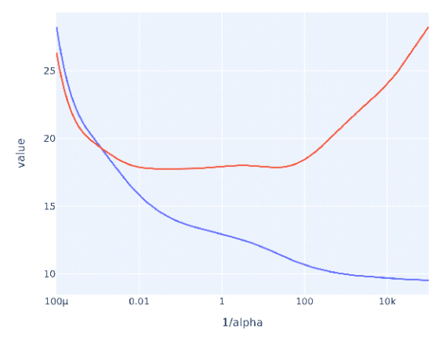

# Quiz 6: Model Selection and Hyperparameter Tuning

## Question 1 (1 point)

In the given graph, what does the blue curve for alpha values on the x-axis and the MSE on the y-axis represent?

**Options:**
1. Test MSE
2. Validation MSE
3. Training MSE
4. Dev MSE

**Answer:** Option 3: Training MSE
- Training MSE represents the model's error on the data it was trained on
- The curve shows how the training error varies with different alpha values (regularization strength)
- Training MSE typically decreases with lower alpha values as the model can fit the training data more closely

---

## Question 2 (1 point)
What can scikit-learn's GridSearchCV be used to find?

**Options:**
1. The most relevant features to include in the model
2. The best scaling technique for the data
3. The optimal set of hyperparameters for a given model
4. The most suitable model architecture for deep learning

**Answer:** Option 3: The optimal set of hyperparameters for a given model
- GridSearchCV systematically works through multiple combinations of parameter tunes
- It performs k-fold cross-validation with each combination of parameter values
- It identifies the best parameter combination based on a specified scoring metric

---

## Question 3 (1 point)
In the Python function GridSearchCV(), what is the purpose of the param_grid parameter?

**Options:**
1. To set the random state for reproducibility
2. To define the cross-validation splitting strategy
3. To specify the grid of hyperparameters to search over
4. To provide the scoring measure for evaluating the model

**Answer:** Option 3: To specify the grid of hyperparameters to search over
- param_grid defines the parameter values to explore during grid search
- It accepts a dictionary mapping parameter names to lists of values
- These values form a grid of all possible parameter combinations to evaluate

---

## Answer Key
1. Option 3: Training MSE (Shows model's error on training data vs regularization strength)
2. Option 3: The optimal set of hyperparameters (GridSearchCV systematically evaluates parameter combinations)
3. Option 3: To specify the grid of hyperparameters (Defines parameter space for grid search)