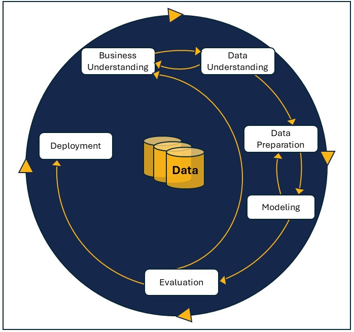

# Statistical Analysis and Machine Learning

At its core, statistical analysis is the underlying driver of ML and artificial intelligence (AI) models. In this section of Module 1, you will be introduced to the concept of probability distribution, which can be defined as all the possible outcomes that a random variable can take within a given range. There are two types of probability distribution: discrete or continuous.

## CRISP-DM Framework

In addition, it is important to mention that due to the complexity of ML and AI problems, a standard, interactive, end-to-end structured approach is essential to make the statistical analysis more functional. The cross-industry standard process for data mining (CRISP-DM), shown in the diagram below, is one of the most popular frameworks in the industry. It is a methodology for planning and executing data mining projects and includes six phases:

1. Business understanding
2. Data understanding
3. Data preparation
4. Modeling
5. Evaluation
6. Deployment

*The CRISP-DM framework*

CRISP-DM is an iterative process, allowing for feedback and adjustments throughout the project. It is widely used for its structured approach to data mining projects.

Keep this in mind as you move through Modules 1 and 2 and build your understanding of statistical analysis and probability.