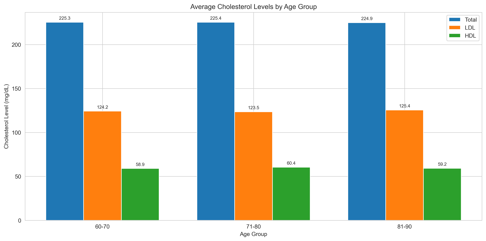

# Required Discussion 1.3: Creating Visualizations Using Personally Sourced Data

## Learning Outcome Addressed
Analyze different data visualization techniques.

*This is a required discussion and counts toward program completion.*

## Prompt
Now that you have had a chance to practice creating a variety of different plots in pandas, you will get the opportunity to create visualizations for your chosen dataset from Discussion 1.2: Data Repositories. As a data scientist, part of your role involves creating visualizations to communicate insights to decision-makers. This allows you to showcase your findings effectively. Using the pandas plot() function, you can create visualizations such as scatter plots, bar charts, or line charts to highlight interesting relationships between different attributes in the data. Keep in mind that you can use the code from the Colab notebook in the previous try-it activity—just create a copy and load your chosen dataset.

Once you have created your visualization, take a screenshot and include it in your response to the following prompt:

**Describe why you selected that plot type and any data transformations required to create it. Additionally, discuss any notable trends observed in the results, such as increased monthly sales or other patterns that emerge from the data.**

## Submission Instructions
Respond to at least two other learners, and suggest ways to make their plots convey the meaning even more clearly.

## Answer Provided

Looking at cholesterol levels in older adults, the data shows that they stay the same from age 60 onwards. The "bad" cholesterol makes up most of the total cholesterol in all age groups, while the "good" cholesterol stays at lower levels throughout.