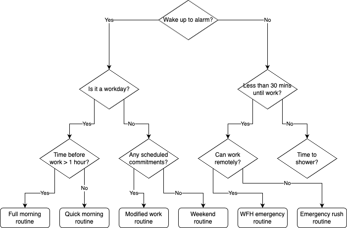

# Morning Routine Decision Tree Narrative

This decision tree illustrates the daily decision-making process of preparing for work in the morning. It all begins with a crucial moment: responding to the alarm. If you wake up to your alarm, the path splits based on whether it's a workday. On workdays, the amount of time before work determines if you can follow your full morning routine (with time for a relaxed breakfast and shower) or need to switch to a quick routine.

For non-workday mornings, the presence of scheduled commitments guides whether you follow a modified work routine or enjoy a leisurely weekend routine. However, if you don't wake up to your alarm, time becomes critical. With less than 30 minutes until work, you must decide if working remotely is an option, leading to either a work-from-home emergency routine or a rushed commute routine. With more time, you can still manage a shortened routine, prioritizing essential tasks like showering if time permits.

Each path leads to a specific morning routine optimized for the circumstances, ensuring you start your day appropriately regardless of the situation.

