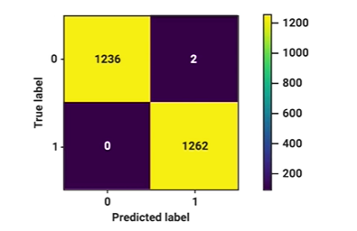

# Quiz 5: Tweet Processing and Model Evaluation

## Question 1 (1 point)
When using the train_test_split function to split a dataset of tweets into training and test sets, which of the following statements is true?

**Options:**
1. train_test_split performs feature scaling on the data as part of the splitting process
2. train_test_split will ensure that the distribution of sentiments in the training and test sets is the same as in the original dataset if you use the stratify parameter
3. train_test_split requires you to manually balance the number of tweets in each class before performing the split
4. train_test_split automatically handles the tokenization of tweets during the split

**Answer:** Option 2: train_test_split will ensure that the distribution of sentiments in the training and test sets is the same as in the original dataset if you use the stratify parameter

*Explanation:* The stratify parameter in train_test_split maintains the same proportion of samples for each class in the training and test sets as in the original dataset. This is crucial for maintaining representative data splits, especially with imbalanced classes.

---

## Question 2 (1 point)
What is the tokenizer used by NLTK for processing tweets?

**Options:**
1. TweetTokenizer
2. PunktTokenizer
3. RegexpTokenizer
4. WhitespaceTokenizer

**Answer:** Option 1: TweetTokenizer

*Explanation:* NLTK's TweetTokenizer is specifically designed for processing tweets, handling special cases like emoticons, URLs, and Twitter-specific syntax like hashtags and mentions.

---

## Question 3 (1 point)
In NLP, why is it important to apply the same preprocessing and feature extraction steps to both training data and test data?

**Options:**
1. To make sure that the feature extraction processes are different for training and test data, allowing the model to generalize better
2. To maintain consistency in the input representation so that the model can learn patterns from the training data and correctly apply them to the test data
3. To ensure that the test data is scaled differently from the training data to improve model performance
4. To reduce the dimensionality of the training data while keeping the test data at its original dimensionality for better evaluation

**Answer:** Option 2: To maintain consistency in the input representation so that the model can learn patterns from the training data and correctly apply them to the test data

*Explanation:* Consistent preprocessing ensures that the model sees the same feature representation during both training and testing, which is essential for reliable model evaluation and performance.

---

## Question 4 (1 point)
Consider the score of the classification model shown in the below confusion matrix:

A confusion matrix showing TP = 0, TN = 2, FP = 1,236, and FN = 1,262.

How many mistakes did the model make?

**Options:**
1. 2
2. 1,236
3. 1,262
4. 0

**Answer:** Option 2: 1,236

*Explanation:* In the confusion matrix, False Positives (FP = 1,236) represent cases where the model predicted positive when the actual value was negative. These are the mistakes the model made in classification. While there are also False Negatives (FN = 1,262), the question specifically asks for the number of mistakes, which is represented by the False Positives value of 1,236.

---

## Answer Key
1. Option 2 (Stratify parameter maintains class distribution)
2. Option 1 (TweetTokenizer is NLTK's specialized tokenizer for tweets)
3. Option 2 (Consistent preprocessing ensures reliable model evaluation)
4. Option 2 (1,236 false positives represent the model's mistakes)