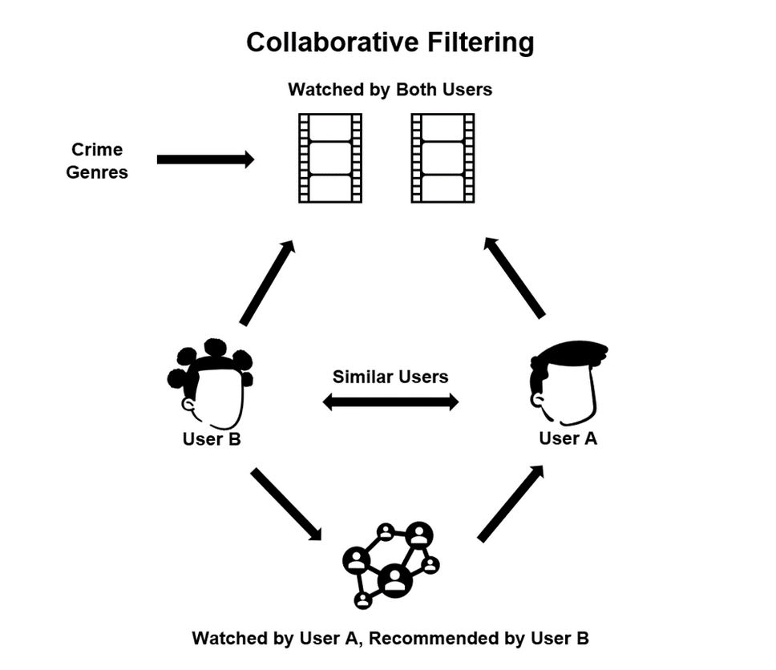

# Overview: Collaborative Filtering

A collaborative filter is an ML method for identifying relationships between data points. This technique is commonly used in recommendation systems to identify similarities between user data and items.

Accordingly, if users A and B enjoy movie A, and user B enjoys movie B as well, then user A may be recommended movie B by the system, as shown in the figure below.

