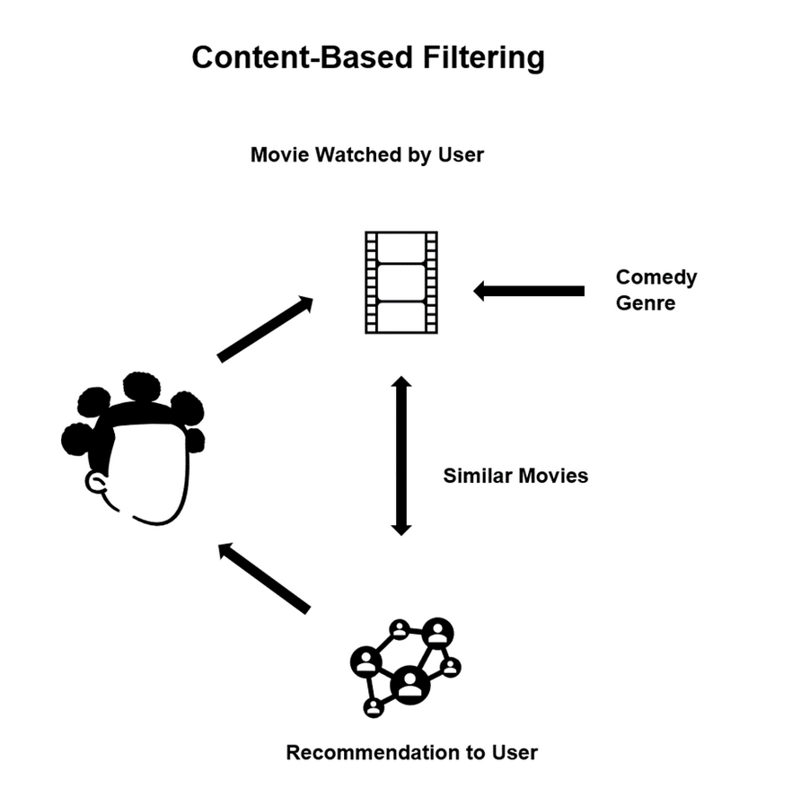

# Overview: Content-Based Filtering

Content-based filtering is a technique that takes advantage of similarities in features to make decisions. Typically, this technique is applied to recommendation systems, which are algorithms used to suggest things to users based on their experience.

Using this method, a user's interests are compared to the product's features. Those products with the most overlap between their features and user interests will be recommended, as shown in the figure below.

