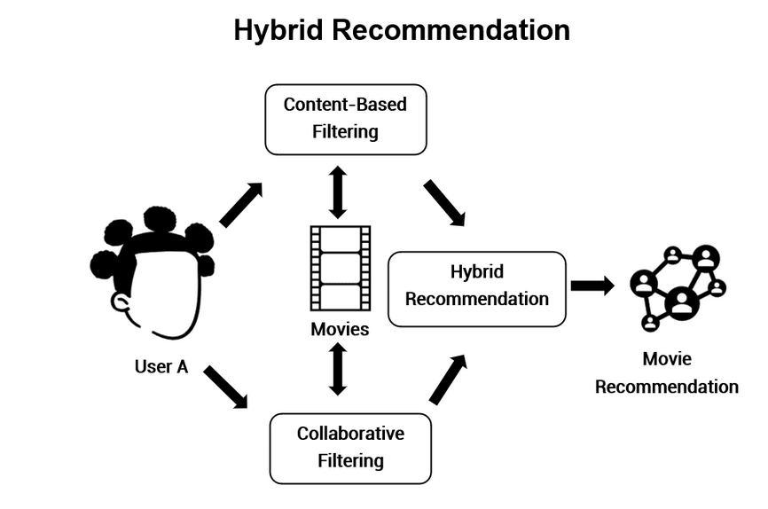

# Overview: Hybrid Recommendation Systems

As you have learned, recommendation systems are software tools that generate and present the user with suggested items and other entities based on various strategies. A hybrid recommendation system combines multiple recommendation strategies to take advantage of their complementary attributes.

As an example, by combining collaborative and content-based filtering, you may overcome some of the shortcomings faced when each method is used separately. You can implement hybrid recommendation system approaches by using content-based and collaborative methods to generate predictions individually and then combining them, or you can simply add the capabilities of collaborative methods to a content-based approach, as shown in the figure below.

